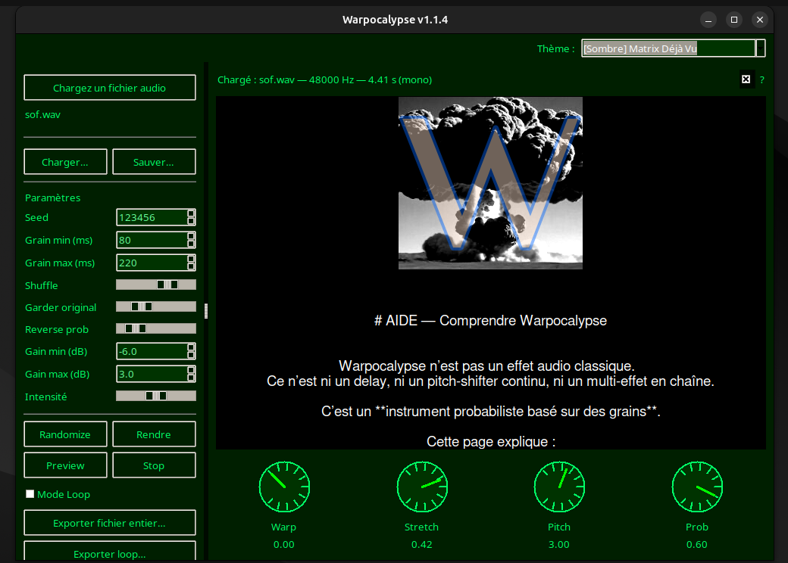
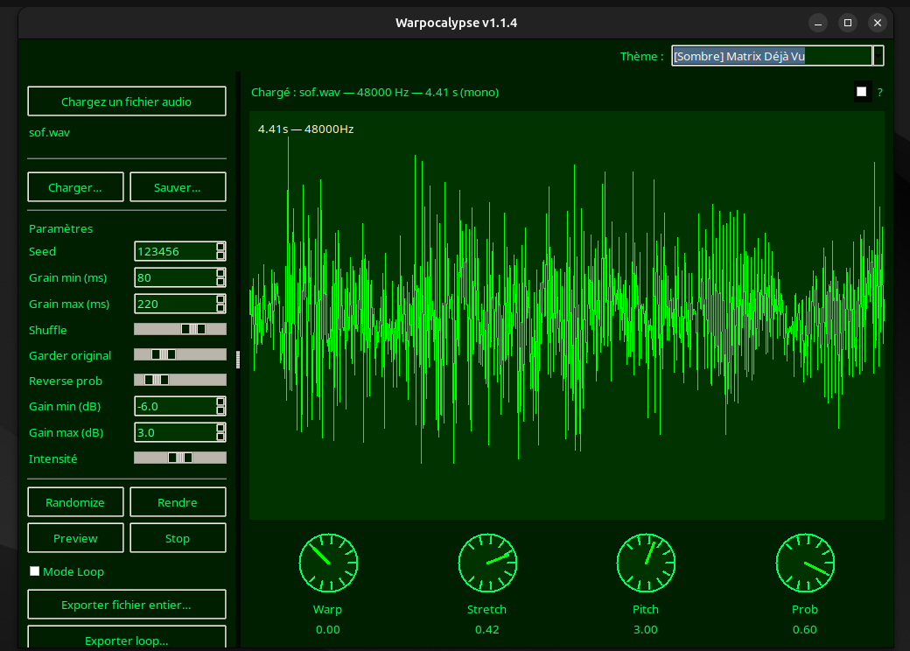

# Warpocalypse

Warpocalypse est un **outil audio expérimental** de transformation et de re-composition sonore.  
Il permet de charger un fichier audio, de le fragmenter, le déformer, le re-synthétiser et d’exporter le résultat en WAV.

L’objectif est **l’accident contrôlé**.

---

## 👁️ Aperçu




---


## 📥 Téléchargement

- 🐧 **Linux**
  - [warpocalypse-1.1.12-linux-x86_64.AppImage](https://github.com/mrklm/warpocalypse/releases)
  - [warpocalypse-1.1.12-linux-x86_64.AppImage.SHA256](https://github.com/mrklm/warpocalypse/releases)
  - [warpocalypse-1.1.12-linux-x86_64.tar.gz](https://github.com/mrklm/warpocalypse/releases)
  - [warpocalypse-1.1.12-linux-x86_64.tar.gz.SHA256](https://github.com/mrklm/warpocalypse/releases)
  
- 🍎 **macOS**
  - [warpocalypse-1.1.12-macOS-x86_64.dmg](https://github.com/mrklm/warpocalypse/releases)
  - [warpocalypse-1.1.12-macOS-x86_64.dmg.sha256](https://github.com/mrklm/warpocalypse/releases)
  - 
- 🪟 **Windows**  
  - [warpocalypse-v1.1.10-windows-x86_64.zip](https://github.com/mrklm/warpocalypse/releases)
  - [warpocalypse-v1.1.10-windows-x86_64.zip.SHA256](https://github.com/mrklm/warpocalypse/releases)

---   
## ✨ Fonctionnalités principales

- Chargement de fichiers audio :
  - WAV (lecture directe)
  - MP3 / FLAC / OGG / AIFF / M4A (via ffmpeg)
- Analyse et affichage de la forme d’onde
- Système de **grains** (durée min / max)
- Paramètres de :
  - Shuffle
  - Reverse probabiliste
  - Gain aléatoire
  - Intensité globale
- Moteur **Warp** :
  - Time-stretch aléatoire
  - Pitch-shift aléatoire
  - Probabilité de warp
- Seed reproductible (même seed → même résultat)
- Mode loop
- Pré-écoute audio
- Export WAV
- Thèmes visuels multiples (sombres, clairs, expérimentaux)

---

## 🧨 Philosophie

Warpocalypse casse la maison mais garde un bout de papier peint.

- Les paramètres influencent des probabilités
- Le résultat peut être subtil ou radical
- Le chaos est borné, jamais totalement libre
- La seed est là pour cadrer l’aléatoire

---

## 🖥️ Prérequis

### Python
- Python **3.10+** recommandé

### Dépendances Python
Principales dépendances :
- `numpy`
- `soundfile`
- `sounddevice`
- `pydub`
- `tkinter` (inclus avec Python sur la plupart des systèmes)
- `Pillow`

Installation typique :
```bash
pip install -r requirements.txt
```

📜 Licence


Ce logiciel est distribué sous la GNU General Public License v3.0.


🛠️ Contribuer

Les contributions sont les bienvenues via Pull Requests.


⚠️ Avertissement

Ce logiciel est fourni sans garantie. L'auteur décline toute responsabilité en cas de dommage ou de dysfonctionnement.


💡 Pourquoi ce projet est-il sous licence libre ?

Ce projet s'inscrit dans la philosophie du logiciel libre, promue par des associations comme April.

Le partage des connaissances et des outils est essentiel pour une société numérique plus juste et transparente.


📬 Contact:

clementmorel@free.fr

🎧️ Bonne destructiration !
